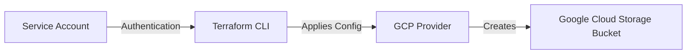

# GCP Storage Bucket Creation using Terraform

This guide explains how to create a **Google Cloud Storage Bucket** using **Terraform** with Service Account authentication. It is intended for beginners and provides a complete end-to-end flow.

---

## Table of Contents

1. [Introduction](#introduction)  
2. [Prerequisites](#prerequisites)  
3. [GCP Authentication via Service Account](#gcp-authentication-via-service-account)  
4. [Terraform Folder Structure](#terraform-folder-structure)  
5. [Terraform Configuration Files](#terraform-configuration-files)  
6. [Terraform Commands Flow](#terraform-commands-flow)  
7. [Architecture Diagram](#architecture-diagram)  
8. [Summary](#summary)  

---

## Introduction

This guide demonstrates creating a **Google Cloud Storage Bucket** using Terraform:

- Using a **Service Account** for authentication
- Writing Terraform configuration files
- Applying and managing infrastructure

---

## Prerequisites

- **GCP account**
- Installed tools:
  - [Terraform](https://www.terraform.io/downloads.html) (v1.5+ recommended)
  - [gcloud CLI](https://cloud.google.com/sdk/docs/install)
- Basic understanding of Terraform concepts: `provider`, `resource`, `variables`

---

## GCP Authentication via Service Account

Terraform requires credentials to manage GCP resources.

### Steps

# Creating a GCP Service Account via Portal

This guide explains how to create a **Service Account** in Google Cloud Platform using the Cloud Console (portal), for Terraform authentication.

---

## Steps

### 1. Login to GCP Console
Go to [Google Cloud Console](https://console.cloud.google.com/) and log in with your account.

---

### 2. Select Your Project
- On the top bar, click the **project dropdown**.  
- Select the project where you want to create the service account.

---

### 3. Navigate to Service Accounts
- In the left-hand menu, go to **IAM & Admin → Service Accounts**.

---

### 4. Create a Service Account
- Click **+ CREATE SERVICE ACCOUNT**.  
- Enter the **Service Account Name** (e.g., `terraform-sa`)  
- Add an optional **Description**.  
- Click **CREATE AND CONTINUE**.

---

### 5. Assign Roles (Permissions)
- Assign roles required for Terraform operations.  
- For creating **Storage Buckets**, assign:
  - **Storage Admin** (`roles/storage.admin`)  
- Click **CONTINUE**.

---

### 6. Grant Users Access (Optional)
- Usually skip this step if Terraform is the only user.  
- Click **DONE**.

---

### 7. Create a Key for Authentication
- Find your new service account in the list.  
- Click the **three dots (⋮)** → **Manage keys**.  
- Click **ADD KEY → Create new key**.  
- Choose **JSON** → Click **CREATE**.  
- A JSON file will download automatically. This is your **service account key**.

---

### 8. Use the Key in Terraform
- Store the JSON file securely.  
- Set the environment variable to let Terraform authenticate:

```bash
export GOOGLE_APPLICATION_CREDENTIALS="/path/to/terraform-sa-key.json"


## Terraform Folder Structure

```
terraform-gcp-storage/
│
├── main.tf
├── variables.tf
├── outputs.tf
└── terraform.tfvars
```

---

## Terraform Configuration Files

### variables.tf

```hcl
variable "project_id" {
  description = "GCP Project ID"
  type        = string
}

variable "region" {
  description = "GCP Region"
  type        = string
  default     = "us-central1"
}

variable "bucket_name" {
  description = "Name of the GCP Storage Bucket"
  type        = string
}
```

### main.tf

```hcl
provider "google" {
  project = var.project_id
  region  = var.region
}

resource "google_storage_bucket" "bucket" {
  name          = var.bucket_name
  location      = var.region
  force_destroy = true
}
```

### terraform.tfvars

```hcl
project_id   = "my-gcp-project-id"
region       = "us-central1"
bucket_name  = "my-terraform-bucket-123"
```

### outputs.tf

```hcl
output "bucket_name" {
  value = google_storage_bucket.bucket.name
}
```

---

## Terraform Commands Flow

1. **Initialize Terraform**

```bash
terraform init
```

2. **Format & Validate**

```bash
terraform fmt
terraform validate
```

3. **Plan Infrastructure**

```bash
terraform plan
```

4. **Apply Infrastructure**

```bash
terraform apply
```

Confirm with `yes`.

5. **Verify**

```bash
gsutil ls -p <PROJECT_ID>
```

6. **Destroy Resources (Optional)**

```bash
terraform destroy
```

---

## Architecture Diagram



- **Service Account** provides credentials to Terraform  
- **Terraform CLI** reads configuration and communicates with GCP  
- **GCP Provider** manages resources on GCP  
- **Storage Bucket** is the final resource created

---

## Summary

- Terraform uses **Service Account authentication** for GCP.  
- Configuration includes **variables, provider, resource, outputs**.  
- Follow **Terraform workflow**: `init → plan → apply → destroy`.  
- Successfully created a **GCP Storage Bucket** with an easy-to-understand architecture.

---
